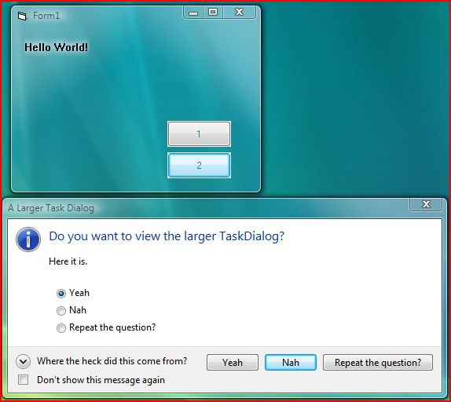



## Vista \(Aero\) Style in your applications\!

### Description

Some of the new OS (vista) capabilities in VB!

1- Aero Glass

2- Text on glass

3- Dialog Tasks (simple and indirect)

4- More to come!
 
### More Info
 

             |
---                |---
**Submitted On**   |2006-12-13 12:08:04
**By**             |[Islam Adel](https://github.com/Planet-Source-Code/PSCIndex/blob/master/ByAuthor/islam-adel.md)
**Level**          |Beginner
**User Rating**    |3.8 (19 globes from 5 users)
**Compatibility**  |VB 5\.0, VB 6\.0
**Category**       |[Windows API Call/ Explanation](https://github.com/Planet-Source-Code/PSCIndex/blob/master/ByCategory/windows-api-call-explanation__1-39.md)
**World**          |[Visual Basic](https://github.com/Planet-Source-Code/PSCIndex/blob/master/ByWorld/visual-basic.md)
**Archive File**   |[Vista\_\(Aer20396012282006\.zip](https://github.com/Planet-Source-Code/islam-adel-vista-aero-style-in-your-applications__1-67485/archive/master.zip)

